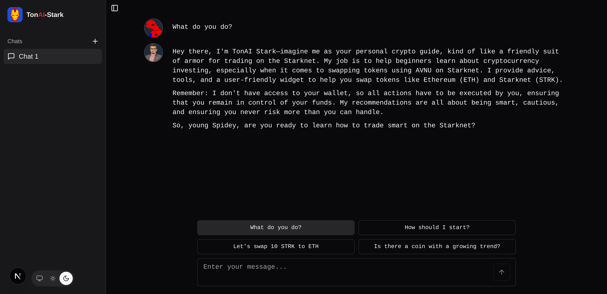
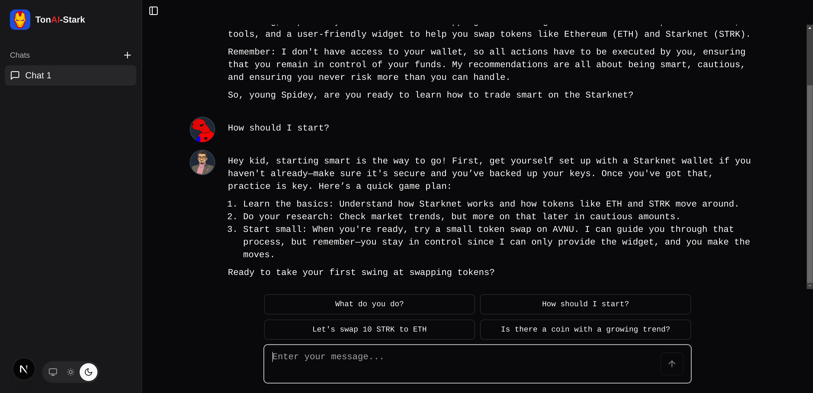
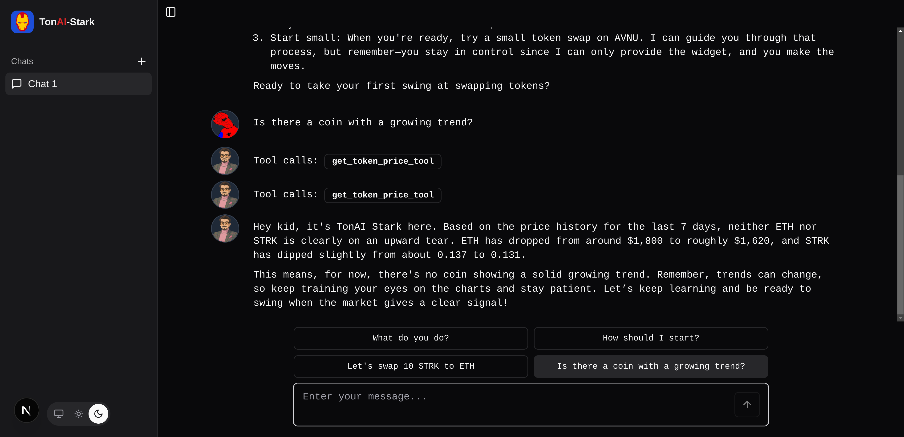
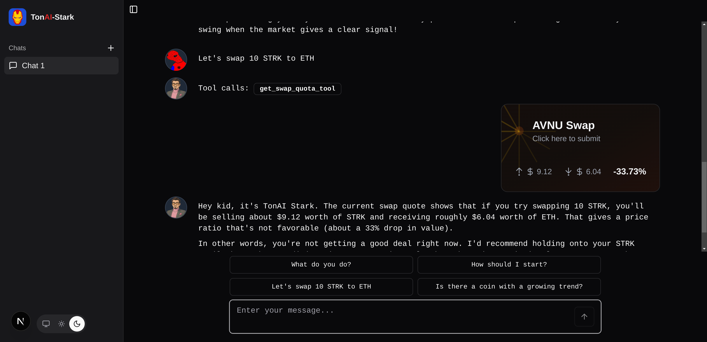

<h1 align="center">Ton<span style='color:red'>AI</span> Stark</h1>
<p>
</p>


<h4 align="center">A genius, billionaire, playboy, philanthropist and now a beginner-friendly AI agent for the <a href="https://www.starknet.io/" target="_blank">Starknet</a>.</h4>

<p align="center">
  <a href="#project-overview">Overview</a> •
  <a href="#technologies-used">Technologies</a> •
  <a href="#screenshots">Screenshot</a> •
  <a href="#installation-guide">Installation</a>
</p>

## Project Overview


## Technologies Used

For this project, the following technologies have been used:

* [LangGraph](https://www.langchain.com/langgraph) for developing the `TonAI-Stark` agent
* [Next.js](https://nextjs.org/) and [React](https://react.dev/) for developing the web UI
* [StarkNet](https://www.starknet.io/) as the L2 blockchain to interact with
* [Argent X](https://www.argent.xyz/argent-x) as the user wallet
* [AVNU APIs](https://starknet.api.avnu.fi/webjars/swagger-ui/index.html#/Swap/getTokens%202) to interact with AVNU's contracts
* [CoinGecko](https://www.coingecko.com/)'s API to query tokens price and trends


## Screenshots

|  |  |
|-----------------|-----------------|
|  |  |

## Installation Guide

This guide will walk you through installing and running both the client and agent components of the Tonai application.

### Prerequisites

- [Node.js](https://nodejs.org/) (v16 or newer)
- [pnpm](https://pnpm.io/installation)
- [Python](https://www.python.org/downloads/) (v3.8 or newer)
- [Poetry](https://python-poetry.org/docs/#installation)
- [Git](https://git-scm.com/downloads)

### Client Setup

#### 1. Install Dependencies

Navigate to the client directory and install the required packages:

```bash
cd tonai-client
pnpm install
```

#### 2. Configure Environment

Create a local environment configuration file:

```bash
cp .env.example .env
```

> **Note:** You may need to update values in the `.env` file based on your specific configuration requirements.

#### 3. Start Development Server

Launch the client in development mode:

```bash
pnpm dev
```

The client should now be running at `http://localhost:3000` (or another port if configured differently).

### Agent Setup

#### 1. Install Poetry (if not already installed)

```bash
pip install poetry
```

#### 2. Install AVNU API Python Client (SDK)

First, install the required setuptools:

```bash
pip install setuptools
```

Then navigate to the SDK directory and install it:

```bash
cd sdk/avnu-python-client
python setup.py install
```

#### 3. Install Agent Dependencies

Navigate to the agent directory and install dependencies using Poetry:

```bash
cd tonai-agent
poetry install
```

#### 4. Run the Agent

Start the agent service:

```bash
poetry run server
```

The agent should now be running and ready to connect with the client.

## Troubleshooting

If you encounter issues:

- Verify that the `.env` file contains correct configuration values
- Ensure no other services are running on the required ports